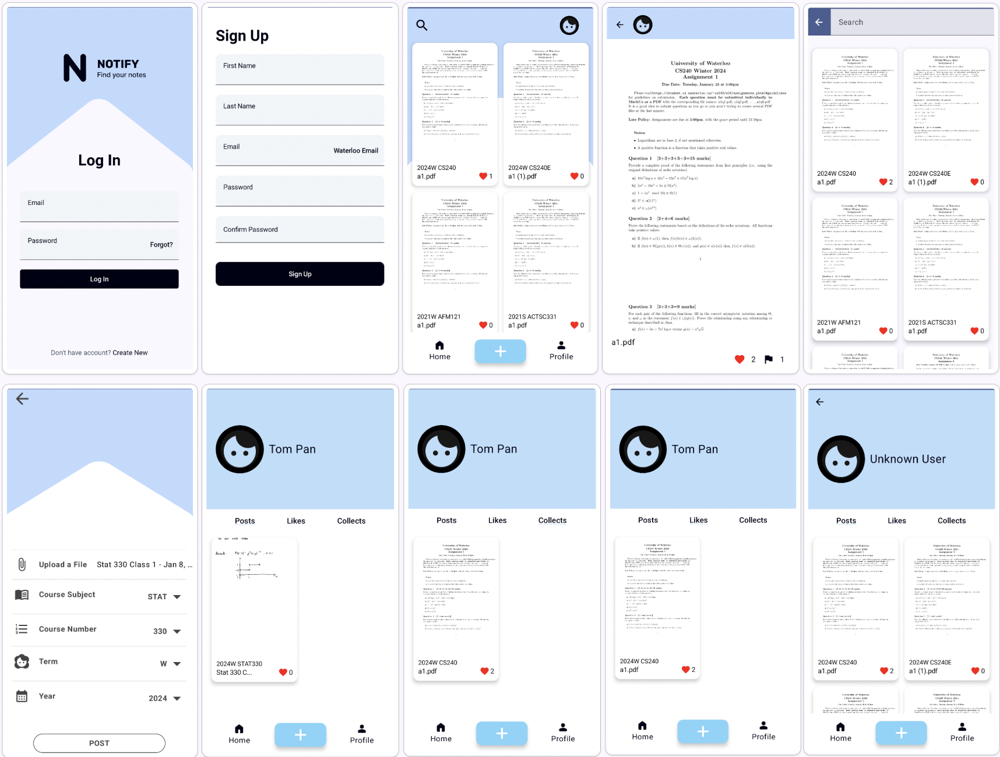

# NOTIFY

## Product Description
Discover Notify, a note-sharing application designed specifically for the University of Waterloo student community. Notify transcends traditional learning boundaries, creating a dynamic and collaborative educational environment where students can seamlessly share, access, and manage academic content.

### Key Features
**Exclusive Access**: Tailored for the University of Waterloo, Notify ensures a secure and relevant academic collaboration space.  
**Real-Time Note Sharing**: Engage with peers through live updates and shared notes, enabling instant access to the latest academic resources.  
**Advanced Search Functionality**: Quickly locate specific notes with our powerful search algorithm that incorporates factors including course code, term, year, and more, making study sessions more efficient. In addition, our integrated OCR technology allows text extraction from scanned documents, enhancing study material accessibility.  

